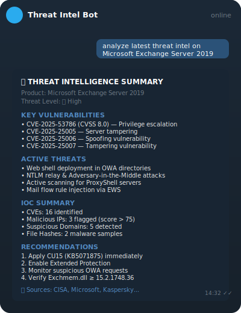
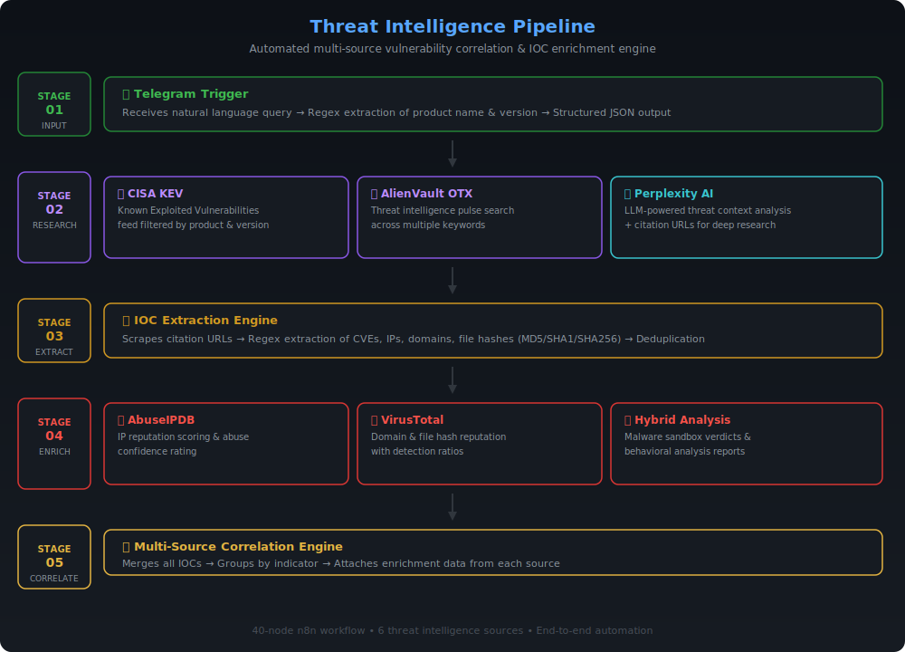
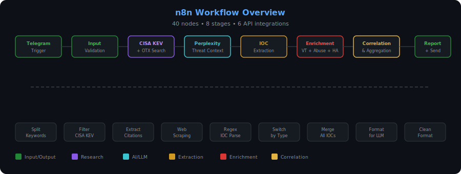
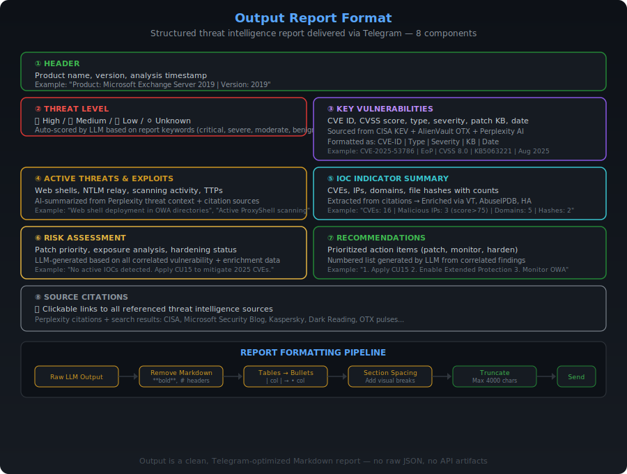

# 🧠 LLM-Enhanced Threat Intelligence Correlation Automation

<div align="center">

[](https://n8n.io)
[](https://docker.com)
[](https://telegram.org)
[](LICENSE)

**Automated multi-source vulnerability correlation &amp; IOC enrichment engine**

*40-node n8n workflow • 6 threat intelligence sources • End-to-end automation*

[Getting Started](#-getting-started) • [Architecture](#-architecture) • [Report Format](#-output-report-format) • [Configuration](#-configuration) • [Data Flow](#-data-flow)

</div>

---

## 🎯 What It Does

<div align="right">
  
</div>

Send a single Telegram message:

```
analyze latest threat intel on Microsoft Exchange Server 2019
```

Get back a **comprehensive threat intelligence report** in under 60 seconds covering CVEs, active threats, IOC indicators, risk assessment, and actionable recommendations — all correlated from 6 different threat intelligence sources.

---

## 🏗️ Architecture

### Pipeline Overview



### n8n Workflow



### Pipeline Stages

| Stage | Name | Sources | Description |
|-------|------|---------|-------------|
| **01** | **Input** | Telegram | Natural language query parsing via regex |
| **02** | **Research** | CISA KEV, OTX, Perplexity AI | Parallel vulnerability lookup &amp; threat context |
| **03** | **Extract** | Citation URLs | Web scraping + regex IOC extraction |
| **04** | **Enrich** | AbuseIPDB, VirusTotal, Hybrid Analysis | Parallel IOC reputation enrichment |
| **05** | **Correlate** | All sources | Multi-source IOC grouping &amp; aggregation |
| **06** | **Report** | Perplexity AI + Telegram | LLM report generation &amp; delivery |

---

## 📋 Output Report Format

> The output report is a core feature of this pipeline — a clean, structured, Telegram-optimized threat intelligence summary generated by correlating data from all sources.

### Report Structure



### Component Breakdown

#### ① Header
Product name, version, and analysis context. Extracted from the user's input query.

```
Product: Microsoft Exchange Server 2019
Version: 2019 (CU14)
```

#### ② Threat Level
Auto-classified severity based on LLM analysis of all correlated data:

| Indicator | Meaning |
|-----------|---------|
| 🔴 **High** | Critical/severe vulnerabilities, active exploitation |
| 🟠 **Medium** | Moderate risk, patches available |
| 🟢 **Low** | Minor issues, limited exposure |
| ⚪ **Unknown** | Insufficient data to classify |

#### ③ Key Vulnerabilities
CVE entries with full context — ID, type, severity score, patch KB, and disclosure date. Sourced from **CISA KEV**, **AlienVault OTX**, and **Perplexity AI** threat context.

```
• CVE-2025-53786 — EoP, CVSS 8.0, KB5063221, Aug 2025
• CVE-2025-25005 — Tampering, Aug 2025
• CVE-2025-25006 — Spoofing, Aug 2025
```

#### ④ Active Threats & Exploits
AI-summarized analysis of current attack vectors, TTPs, and exploitation activity. Generated by Perplexity AI from the latest threat intelligence sources.

```
• Web shell deployment in OWA directories
• NTLM relay & Adversary-in-the-Middle attacks
• Active scanning for ProxyShell-vulnerable servers
• Mail flow rule injection via EWS
```

#### ⑤ IOC Indicator Summary
Aggregated counts of all extracted and enriched indicators:

```
• CVEs: 16 identified
• Malicious IPs: 3 (AbuseIPDB score > 75)
• Suspicious Domains: 5 (VirusTotal detected)
• File Hashes: 2 malware samples (Hybrid Analysis confirmed)
```

Each IOC is extracted from citation URLs via regex, then enriched through:
- **AbuseIPDB** → IP reputation scoring
- **VirusTotal** → Domain & hash detection ratios
- **Hybrid Analysis** → Malware sandbox verdicts

#### ⑥ Risk Assessment
LLM-generated analysis of the overall threat posture — patch priority, exposure analysis, and hardening status based on all correlated data.

```
No active IOCs detected in environment. Unpatched systems
vulnerable to spoofing/EoP leading to RCE. Patch priority: CRITICAL.
```

#### ⑦ Recommendations
Prioritized, numbered action items generated by the LLM from all findings:

```
1. Apply CU15 (KB5071875) immediately
2. Enable Extended Protection for authentication
3. Monitor suspicious OWA requests
4. Verify Exchmem.dll version ≥ 15.2.1748.36
```

#### ⑧ Source Citations
Clickable links to all referenced threat intelligence sources — Perplexity citations, search results, CISA advisories, vendor bulletins, and security research articles.

```
📎 CISA • Microsoft Security Blog • Kaspersky • Dark Reading
   OTX • VirusTotal • AbuseIPDB
```

### Report Formatting Pipeline

The raw LLM output goes through a **4-stage formatting pipeline** before delivery:

| Stage | Transformation |
|-------|---------------|
| **Remove Markdown** | Strips `**bold**`, `# headers`, emojis for clean Telegram rendering |
| **Tables → Bullets** | Converts Markdown tables (`| col | col |`) to readable bullet points |
| **Section Spacing** | Adds visual breaks between sections for readability |
| **Truncate** | Caps at 4,000 characters (Telegram message limit) with `[Truncated]` notice |

This ensures the final output is a **clean, readable, Telegram-optimized report** — no raw JSON, no API artifacts, no formatting noise.

---

## 📁 Repository Structure

```
llm-threat-intel-n8n/
├── README.md                              # Project documentation
├── LICENSE                                # MIT License
├── .env.example                           # Environment variable template
├── .gitignore                             # Git ignore rules
├── docker-compose.yml                     # n8n container orchestration
├── assets/
│   └── images/
│       ├── architecture.svg               # Pipeline architecture diagram
│       ├── workflow-overview.svg          # n8n workflow node overview
│       ├── report-format.svg              # Output report format breakdown
│       └── sample-output.svg              # Sample Telegram output
├── docs/
│   └── ARCHITECTURE.md                    # Detailed technical documentation
├── n8n/
│   ├── workflows/
│   │   └── threat-intel-workflow.json     # Main workflow (import into n8n)
│   └── credentials/
│       └── credentials-template.json      # Credential structure reference
└── scripts/
    └── setup.sh                           # Automated setup script
```

---

## 🚀 Getting Started

### Prerequisites

- [Docker](https://docs.docker.com/get-docker/) &amp; Docker Compose
- API keys for the services below ([how to get them](#-api-keys))

### Quick Start

```bash
# 1. Clone the repository
git clone https://github.com/Malaiyappan-STUX05/llm-threat-intel-n8n.git
cd llm-threat-intel-n8n

# 2. Configure environment variables
cp .env.example .env
# Edit .env with your API keys

# 3. Start n8n
docker-compose up -d

# 4. Open n8n at http://localhost:5678
# 5. Import the workflow from n8n/workflows/threat-intel-workflow.json
# 6. Configure credentials (see below)
# 7. Activate and test!
```

### API Keys

| Service | Purpose | Free Tier | Get Key |
|---------|---------|-----------|---------|
| **Telegram Bot** | Send/receive messages | Unlimited | [@BotFather](https://t.me/BotFather) |
| **Perplexity AI** | LLM threat analysis | 5M tokens/mo | [perplexity.ai/settings/api](https://www.perplexity.ai/settings/api) |
| **AlienVault OTX** | Threat intel pulses | Unlimited | [otx.alienvault.com](https://otx.alienvault.com/) |
| **VirusTotal** | IOC enrichment | 4 req/min | [virustotal.com](https://www.virustotal.com/) |
| **AbuseIPDB** | IP reputation | 1000 req/day | [abuseipdb.com](https://www.abuseipdb.com/) |
| **Hybrid Analysis** | Malware analysis | 200 req/day | [hybrid-analysis.com](https://www.hybrid-analysis.com/) |

### Configuring Credentials in n8n

1. Open n8n → **Settings** → **Credentials** → **Add Credential**
2. Add each service:

| Credential Name | Type | Configuration |
|-----------------|------|---------------|
| Telegram Bot API | `telegramApi` | Paste your bot token |
| Perplexity AI | `httpHeaderAuth` | Name: `Authorization`, Value: `Bearer YOUR_KEY` |
| VirusTotal | `httpHeaderAuth` | Name: `x-apikey`, Value: `YOUR_VT_KEY` |
| AbuseIPDB | `httpHeaderAuth` | Name: `Key`, Value: `YOUR_ABUSEIPDB_KEY` |
| Hybrid Analysis | `httpHeaderAuth` | Name: `api-key`, Value: `YOUR_HA_KEY` |

> 💡 The OTX API key is configured directly in the workflow's HTTP header node.

### Setting Up the Telegram Webhook

After activating the workflow:

```bash
# Get the webhook URL from the Telegram Trigger node in n8n
# Then register it with Telegram:
curl -X POST "https://api.telegram.org/bot<YOUR_BOT_TOKEN>/setWebhook?url=<WEBHOOK_URL>"
```

### Testing

```
# Send to your Telegram bot:
analyze latest threat intel on Microsoft Exchange Server 2019

# Wait 30-60 seconds for the full pipeline
# Receive a detailed threat report in Telegram! 🎉
```

---

## 🔧 Configuration

### Input Format

```
analyze latest threat intel on <product> <version>
```

**Examples:**
```
analyze latest threat intel on Apache Tomcat 9.0
analyze latest threat intel on Microsoft Exchange Server 2019
analyze latest threat intel on Nginx 1.24
analyze latest threat intel on WordPress 6.4
analyze latest threat intel on OpenSSL 3.0
```

### Customization

| Setting | Location | Default |
|---------|----------|---------|
| Search keywords | Input validation node | `["CVE", "Vulnerability", "Exploit", "Threat", "Malware"]` |
| OTX result limit | Loop OTX Search URL | `5` per keyword |
| Perplexity max tokens | Pplx intel source body | `500` |
| Telegram output limit | Report formatting node | `4000` chars |

---

## 📊 Data Flow

```
┌─────────────┐    ┌──────────────┐    ┌─────────────┐
│  Telegram    │───▶│Input Parsing │───▶│  CISA KEV   │
│  Message     │    │(Regex extract)│    │  OTX Search │
└─────────────┘    └──────┬───────┘    │  Perplexity  │
                          │            └──────┬──────┘
                          │                   │
                          │            ┌──────▼──────┐
                          │            │  IOC Extract │
                          │            │ (Web scrape) │
                          │            └──────┬──────┘
                          │                   │
                          │     ┌─────────────┼─────────────┐
                          │     ▼             ▼             ▼
                          │ ┌────────┐  ┌────────┐  ┌──────────┐
                          │ │Abuse   │  │Virus   │  │Hybrid    │
                          │ │IPDB    │  │Total   │  │Analysis  │
                          │ └───┬────┘  └───┬────┘  └────┬─────┘
                          │     └─────────────┼───────────┘
                          │                   ▼
                          │          ┌──────────────┐
                          │          │  Correlation  │
                          │          │  & Aggregation│
                          │          └──────┬───────┘
                          │                 ▼
                          │          ┌──────────────┐
                          │          │Perplexity AI  │
                          │          │Report Generate│
                          │          └──────┬───────┘
                          │                 ▼
                          │          ┌──────────────┐
                          │          │  Formatting  │
                          │          │  Pipeline    │
                          │          └──────┬───────┘
                          │                 ▼
                          │          ┌──────────────┐
                          └─────────▶│  Telegram     │
                                     │  Reply        │
                                     └──────────────┘
```

---

## 🛡️ Security

- **Never commit `.env` files** — contains API secrets
- **Rotate API keys** regularly
- **Rate limits** (free tiers):
  - VirusTotal: 4 requests/min
  - AbuseIPDB: 1,000 requests/day
  - Hybrid Analysis: 200 requests/day
  - Perplexity: Check your plan limits
- **Webhook security**: n8n generates a unique webhook URL per workflow

---

## 📄 License

[MIT](LICENSE) © 2025 Malaiyappan S
